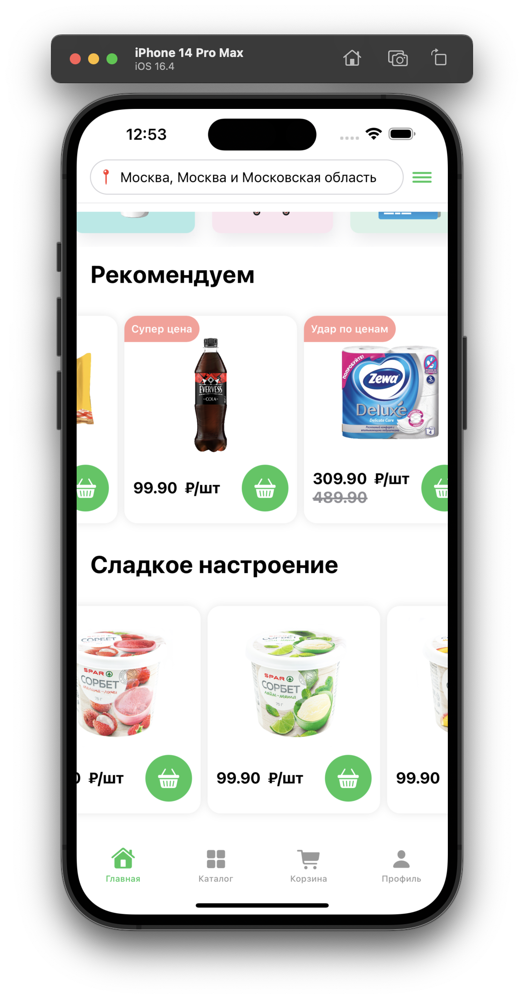

# SPAR

Тестовое задание на вакансию intern [iOS Developer.](https://hh.ru/vacancy/84750051?hhtmFrom=vacancy_response)

Выполнил: **Сорокин Александр**   

Время выполнения: 3ч 39мин.   

Небольшое предисловие: 
Ввиду отсутствия макета и ассетов, я использовал изображения из интернета. Размеры компонентов подбирались схематично. Иконки - SF Symbols.   

## Preview

<!--  -->

<div style="display: flex;">
   
   
   
</div>

### Info

**Components** - папка с реализацией компонентов - сторис, большой баннеры, маленький, карточка товара.

**View** - основные View. 
Чтобы не засорять `HomeView` решено было вынести `ScrollView` в отдельные view. Находятся внутри папки **ScrollViews**.   

`HomeView.swift` - содержит все view. Используется в `NavTabView.swift`.   

Сторонние библиотеки не использованы.   

## Requirements

 - iOS 14.0 or later
 - Xcode 14.0 or later

## Contribution

If you find any issues or want to contribute to the project, please create a Pull Request or make an Issue in this repository.

## Installation

1. Clone the Tic Tac Toe repository:

   ```shell
   git@github.com:KeoFoxy/CarParadise.git
   ```
2. Open the `CarParadise.xcodeproj` project in Xcode.
3. Build and run the project on a simulator or a real device.